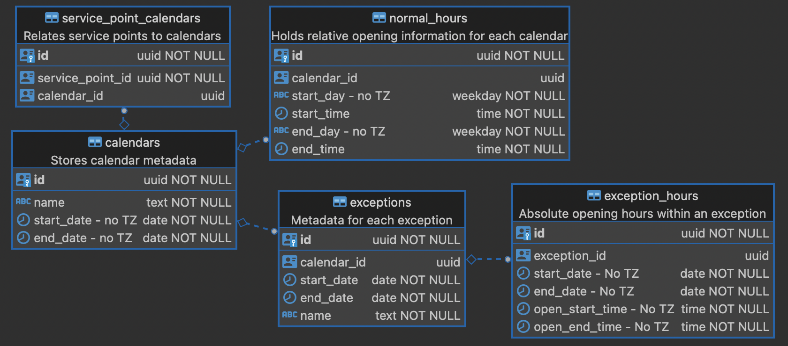

# Database Schema

A lot of thought and effort went into the database schema for this module. Quick response time is
essential due to the fundamental nature of this module, therefore, a strictly relational and
normalized schema is used.

## Timezone and Localization Support

For the database, all dates, times, and weekdays are timezone-agnostic. This is by design for a few
reasons:

- Simpler correspondence between the interface and the storage
- Elimination of potential complications with regards to all-day hours (and in particular, closure
  exceptions)
- Daylight savings/summer time will not affect the ranges
  - Without this, daylight savings would cause strange "jumps" halfway through each semester wherein
    the hours would be shifted before or after the clock change.

## Calendars to Service Points

Service points and calendars are many-to-many: a service point can have multiple calendars (although
none that overlap) and a calendar can be assigned to multiple service points.

## Exceptions

Exceptions are many-to-one to calendars: a calendar can have multiple exceptions but each exception
belongs to only one calendar.

### Exception Hours

Exception information is stored inside the `exception_hours` table -- the `start_date` and
`end_date` in the `exceptions` table is simply for indexing and performance reasons and should
contain the first and last day covered by its hours.

For the hours, the start/end date are self explanatory. If the exception overrides normal opening
hours, there will be a `open_start_time` and `open_end_time`. If it closes the library, these will
be `NULL`.

Exceptional opening hours will close the library for the rest of the calendar day (allowing an
exception to effectively reduce the hours).

## Versioning

For database versioning, `liquibase` is used. The changelogs are stored in
`src/main/resources/db/changes`. Each new change should be stored as a separate file (preferably
YAML, unless SQL is required) in this directory with the form `####-LABEL.yaml`, where `####` is ten
above the previous change.

This numbering system allows changes to be inserted between others later, for maximum flexibility.
If possible, a changelog should be split into separate parts, which will then be in the form
`####-LABEL-$$-sub-label.yaml` where `$$` is sequential within the specific changelog. See
`0010-initial` for a good example of this.

## Updating the Schema

Liquibase will automatically be called to update the database whenever a `POST` request is sent to
`/_/tenant`. This special route is used by Okapi whenever a module is installed for the first time
or updated. Okapi/Spring Boot will _not_ attempt a liquibase update command otherwise.

In a development environment, it may be useful to invoke a liquibase update directly and not deal
with Okapi or the module's API. A particularly useful case of this is whenever a JPA query relies
upon a table that has not been created; in this instance, the application will fail to start without
that table, therefore, there is no chance of invoking the API.

In order to invoke liquibase directly, you may use the Maven goal `liquibase:update`:
`mvn liquibase:update`. The [`liquibase.properties`](src/main/resources/db/liquibase.properties)
file specifies the default Okapi database credentials in order to upgrade `diku`'s installation;
other tenants/setups can be specified by editing this, `pom.xml`, or adding command-line options to
Maven.
